# Welcome RecipeApp Repository

  
<strong>Summary</strong>

This is a responsive web application for mobile devices, developed during my training at [trybe](https://www.betrybe.com/). Its purpose is to search for food and drink recipes, as well as a page to follow a recipe step by step and favorite it. It also has a login page to access the application.
Using the APIs:
[Meals](https://www.themealdb.com/api.php) e [Cocktail](https://www.thecocktaildb.com/api.php)

This project was developed in a sprint, where my class was divided into a group of 6 people. We had to organize ourselves to deliver the project on time, in addition to trying to maintain organization. In a learning environment this can be tricky, but we can do it. To do this, we use Kanban on Trello and communicate a lot through the Slack application.

After we started looking for a challenge, I decided to develop it alone to test my abilities and this was the result.

## Opening Application

 
  
<strong>Browser</strong>

copy the repository to a local folder using the terminal and passing the command:

`git clone git@github.com:juliomatiastrybe/recipes-app.git`

If you don't have git installed, you can install it using this command in the shell and bash terminal:

Debian/Ubuntu bash:
`apt-get install git`

other kernel follow the instructions on the website [Git](https://git-scm.com/download/linux).

windows/powershell:
`winget install --id Git.Git -e --source winget`

Or you can follow the website [git](https://git-scm.com/downloads) documentation for more installation means.

navigate to the folder created in the clone, and open the terminal.

install the dependencies:

`npm install, pnpm install or yarn install`

you need to have node installed to be able to install the dependency packages
If you don't have it, you can run the command if your operating system is Linux:

`sudo apt update sudo apt install nodejs sudo apt install npm`

If not, follow the installation instructions on the [Node.js](https://nodejs.org/en/download) website.

Still in the terminal, open the application in the browser:

`npm run dev`

using this command application will open in the browser. 

  
<strong>Url</strong>

  If you want an option to view the application more easily and quickly, click on [APP](https://recipes-app-jcdev-nu.vercel.app/)
  

## Technology used

  
<strong>See about</strong>

  ### Kanban Trello

  

    
<strong>See about</strong>

  We used Kanban Trello as an agile methodology to better organize the tasks that each person would perform, this gave us an idea of what a real sprint would be like in the workplace.

  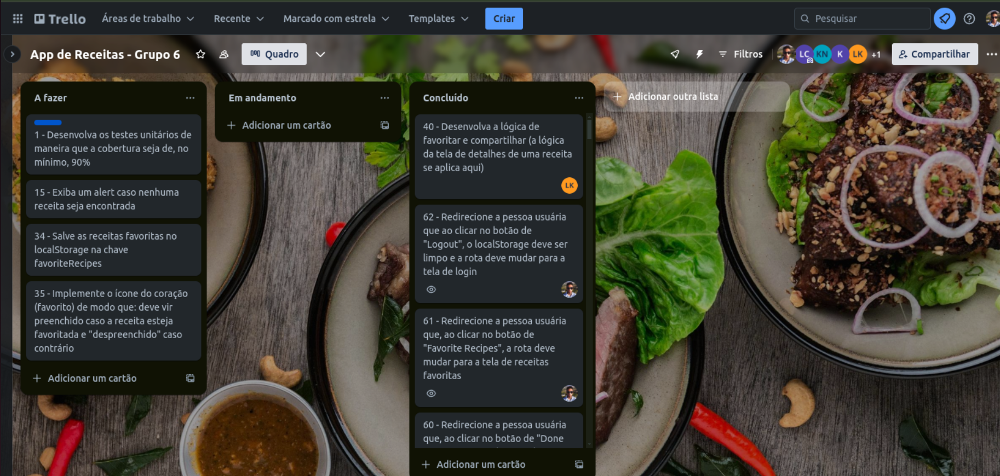

  

  ### Testing Integration Using RTL

  

    
<strong>See about</strong>

  The application has integration test coverage, using Vitest with RTL. To see it, simply execute the command in the terminal:
  `npm run test`

  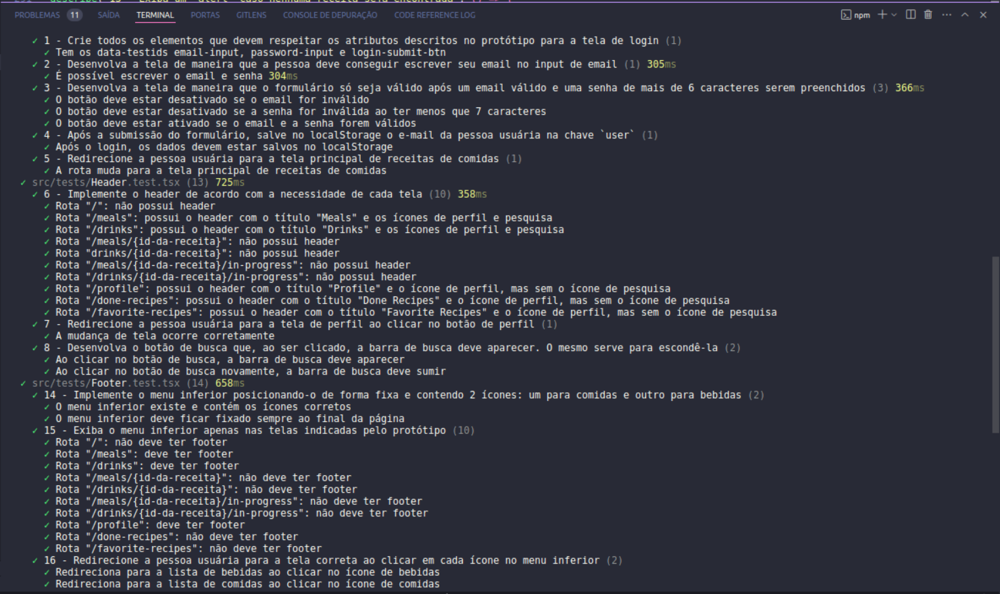

  

  

  
  
  
  
  
  
    

## Application

  
<strong>See about</strong>

  ### Login

  

  
<strong>See about</strong>

  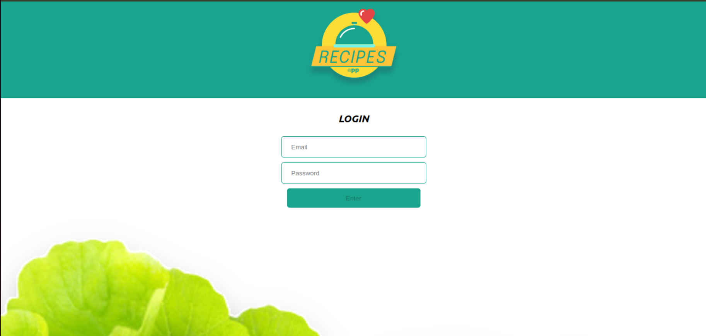
  

  ### Drinks

  

  
<strong>See about</strong>

  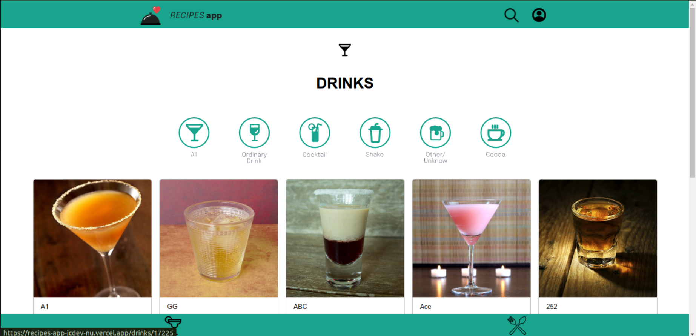
  

  ### Meals

  

  
<strong>See about</strong>

  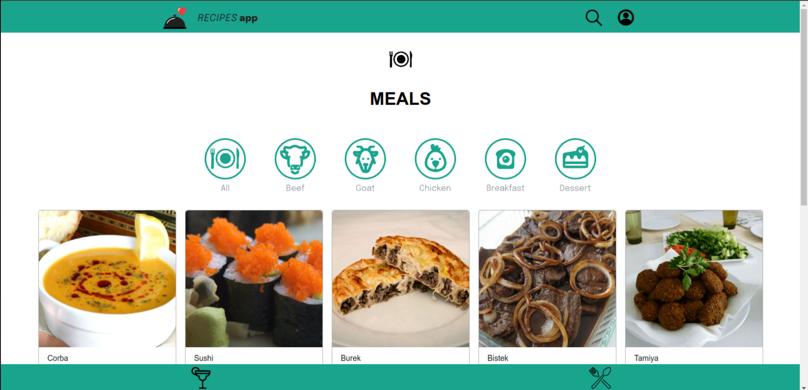
  

  ### Recipe Infos

  

  
<strong>See about</strong>

  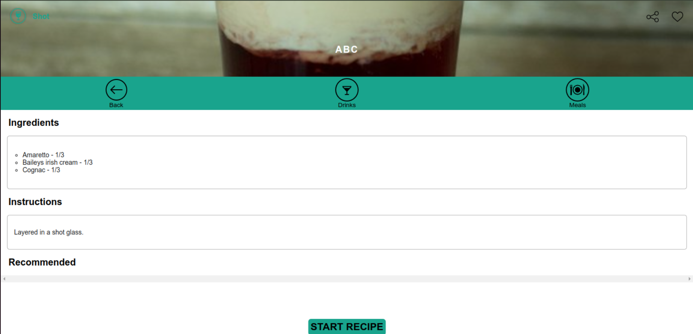
  

  ### Started Recipe

  

  
<strong>See about</strong>

  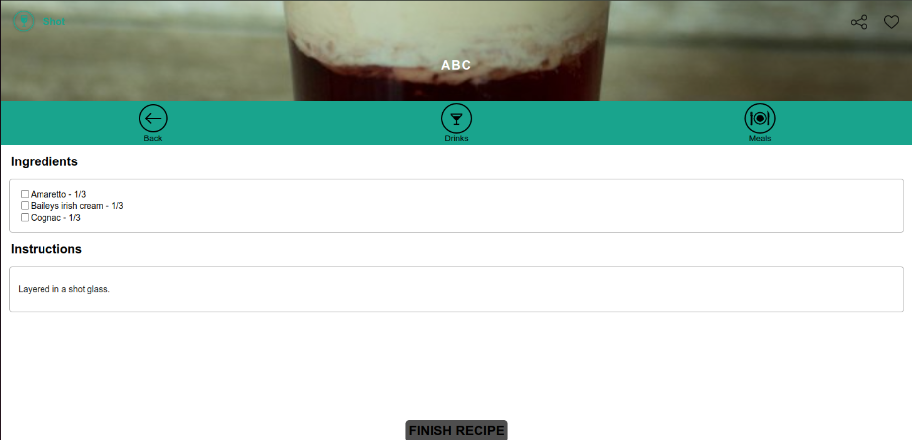
  

  ### Finish Recipe

  

  
<strong>See about</strong>

  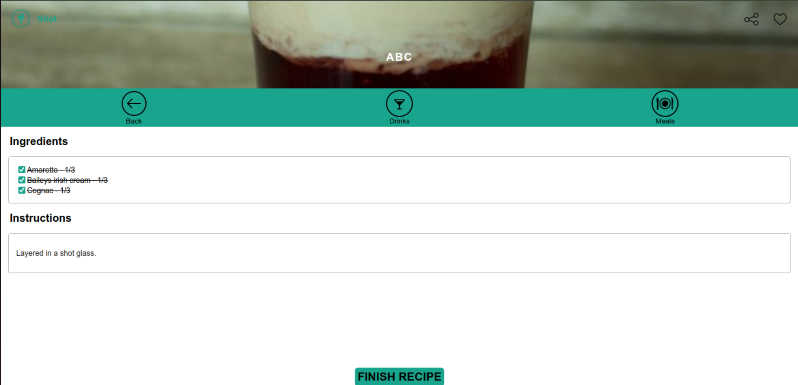
  

  ### Done Recipes

  

  
<strong>See about</strong>

  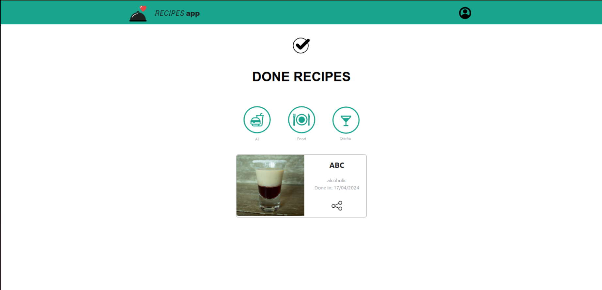
  

  ### Favorite Recipes

  

  
<strong>See about</strong>

  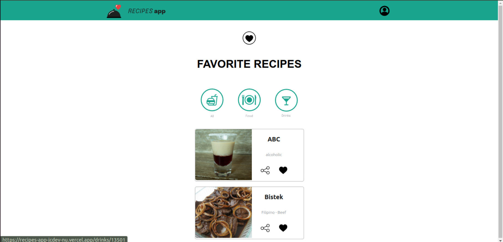
  

  ### Profile

  

  
<strong>See about</strong>

  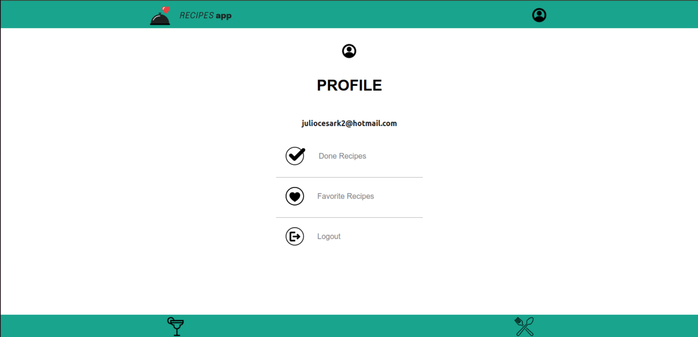
  

## Acknowledgment

  
<strong>See about</strong>

Although this application, after finishing the evaluation period, I did it alone, a good part of the styling and even some ideas about the codes I got from my teammates who helped me during the development. I leave here a caveat for everyone.

[Karina Bezerra](https://www.linkedin.com/in/karina-bezerra-408751200/)\
[Karine Bueno](https://www.linkedin.com/in/karine-bueno-dev/)\
[Lucas Costa](https://www.linkedin.com/in/lucascbmelo/)\
[Leornado Kila](https://www.linkedin.com/in/leonardo-kila-00a9a62a9/)
 

